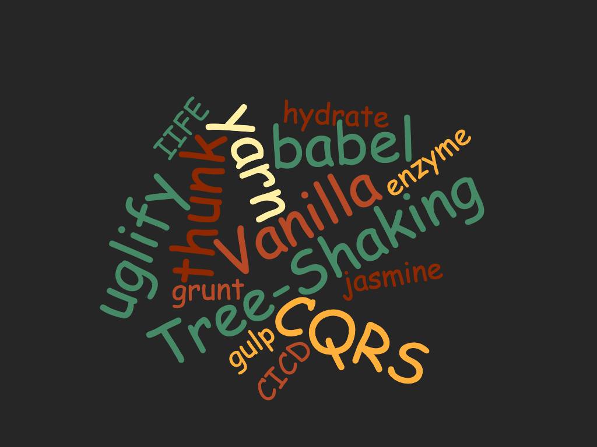

import { Head } from "mdx-deck";
export { future as theme } from "mdx-deck/themes";

<Head>
    <title>Knowledge Session V 🤯</title>
</Head>

# Knowledge Session V

---

## Meet our special guest

# 😸

---

[New Edge](https://blogs.windows.com/windowsexperience/2019/04/08/microsoft-edge-preview-builds-the-next-step-in-our-oss-journey/)

---

---

## top 5

-   [vanilla](http://vanilla-js.com/)
-   [hydrate](https://reactjs.org/docs/react-dom.html#hydrate)
-   [tree-shaking](https://webpack.js.org/guides/tree-shaking/)
-   [uglify](http://lisperator.net/uglifyjs/)
-   [IIFE](https://developer.mozilla.org/en-US/docs/Glossary/IIFE)

---

## Webpack Demo

---

## Component state

### vs

## Redux state

---

## Pull request

---

## Syled Component

[Repo](https://www.styled-components.com/)

---

## ES6 Practices

---

## Until Next Time 👋
